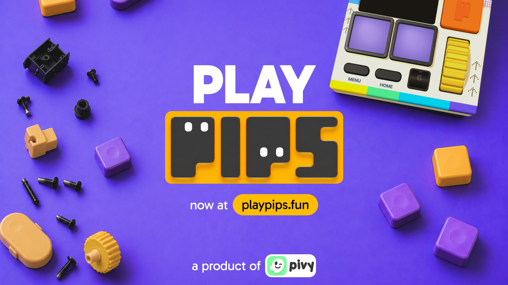

# PIPS

### World’s First Virtual Gamified Trading Console

**Built for Fun and Money. Powered by DeepBook Predict.**

[Play PIPS](https://playpips.fun)

## Trading should feel more fun

PIPS turns trading into a virtual handheld console. No order-book overload, no wall of charts, and no wallet setup. Sign in, pick a game, press the buttons, and play.

Under the console, PIPS runs on **Sui** and uses **DeepBook Predict** for real on-chain trading positions.

## How it works

1. Sign in with Google or email.
2. Get an embedded Sui wallet automatically.
3. Play a trading game such as **I Feel Lucky** or **Range**.
4. Watch the position live, cash out early, or hold until expiry.
5. Build your balance, unlock achievements, and climb the leaderboard.

## The games

- **I Feel Lucky:** Spin for an asset, direction, and multiplier. Take the deal and ride the market.
- **Range:** Pick where the price will land. A tighter range pays more.
- **Line Rider and Candle Hop:** Quick arcade games built into the same console.

## Powered by DeepBook Predict

PIPS makes DeepBook Predict feel like a game without hiding the real market underneath. Lucky and Range plays mint real Predict positions, follow live prices, and redeem on-chain.

PIPS runs its own DeepBook Predict deployment on a dedicated Sui network, with fast markets designed for short, playable rounds.

## Built with

- Sui Move and DeepBook Predict
- React 19, TanStack Start, Three.js, and Tailwind CSS
- Bun, Fastify, Prisma, and PostgreSQL
- Privy embedded Sui wallets

## Sui Overflow 2026

PIPS is a submission for **Sui Overflow 2026**.

Try it at [playpips.fun](https://playpips.fun).

## Contact

[Kelvin Adithya on Telegram](https://t.me/KelvinAdithya)
